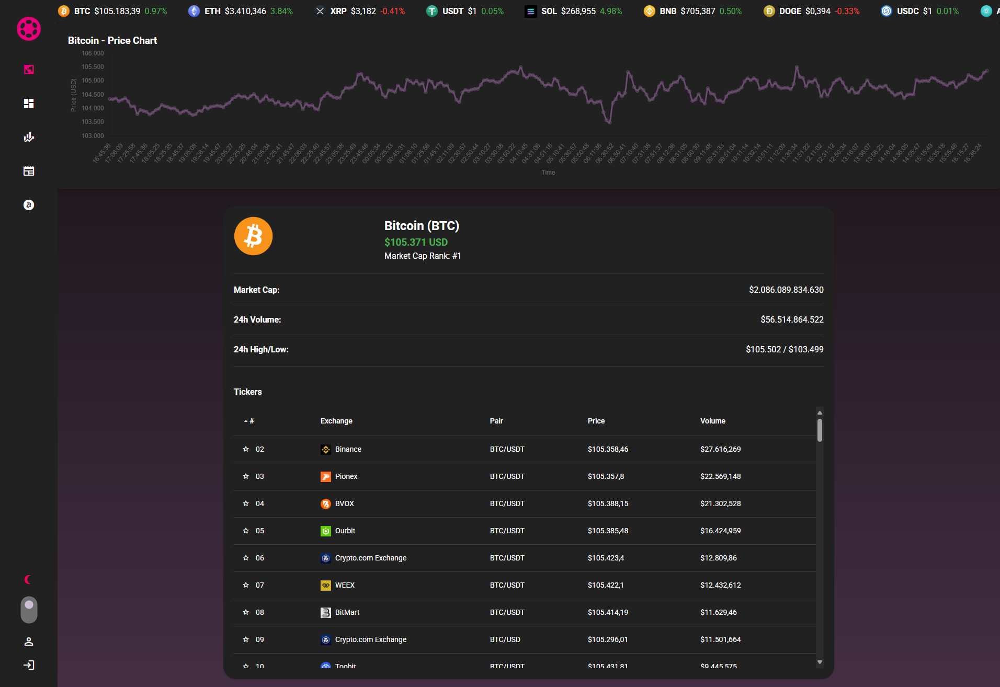

<h1 align="center">
  CoinPulse
</h1>

<p align="center">
  
</p>

O **CoinPulse** é um DashBoard moderno e responsivo construído com Vue.js e Vuetify. A plataforma permite que os usuários acompanhem dados de mercado de criptomoedas em tempo real, gerenciem seus ativos favoritos e visualizem gráficos detalhados para análises personalizadas.

## 💻 Visão Geral

O **CoinPulse** oferece uma experiência intuitiva e funcional para entusiastas de criptomoedas, com recursos que incluem:

- Navegação interativa por mercados de criptomoedas.
- Acompanhamento de preços e volumes em tempo real.
- Gestão de ativos favoritos com sincronização ao Firebase.
- Visualização de gráficos dinâmicos e análises visuais dos ativos.
- Interface responsiva, projetada com Vuetify para excelente usabilidade em diferentes dispositivos.

A aplicação utiliza o **Firebase** para autenticação e gerenciamento de dados do usuário, garantindo uma experiência personalizada e segura. Além disso, integra o **Pinia** para gerenciamento de estado e **Chart.js** para criação de gráficos interativos.

## ⚙️ Funcionalidades

- **Navegação por Tickers:** Visualize informações detalhadas sobre os tickers, incluindo preço, volume e pares de mercado.
- **Gerenciamento de Favoritos:** Adicione e remova tickers favoritos com sincronização automática ao Firebase.
- **Visualização Personalizada:** Gráficos interativos de barra e pizza que analisam seus ativos favoritos.
- **Autenticação de Usuário:** Login seguro com Firebase Authentication, garantindo acesso restrito a funcionalidades específicas.
- **Notificações e Atualizações:** Interface amigável para alertas e novidades do mercado.

## 🛠️ Tecnologias

As principais tecnologias utilizadas no projeto incluem:

- **Vue.js:** Framework progressivo para construção de interfaces de usuário.
- **Vuetify:** Biblioteca de componentes baseada no Material Design.
- **Pinia:** Gerenciamento de estado moderno e simples para Vue.js.
- **Firebase:** Backend como serviço, incluindo Authentication, Realtime Database e Analytics.
- **Chart.js:** Biblioteca para visualização de dados interativa e responsiva.

## 🔒 Autenticação de Usuário
Acesse funcionalidades exclusivas ao fazer login na plataforma. Usuários autenticados podem gerenciar favoritos e visualizar análises personalizadas.

<p align="center">  </p>


## 🛠️ Instalação

### Requisitos

- Node.js (versão 14 ou superior)
- npm (versão 6 ou superior)

### Passos

1. **Clone o repositório:**

```sh
git clone https://github.com/RodrigoRodrigues-Dev/CoinPulse.git

cd CoinPulse
```

2. **Instale as dependências:**

```sh
npm install
```
<br>

## 📃 Licença
Este projeto está licenciado sob a Licença MIT - veja o arquivo [LICENSE](LICENSE) para mais detalhes.
<br>
## ☎️ Contato
Desenvolvido por [Rodrigo Rodrigues](https://github.com/RodrigoRodrigues-Dev). Entre em contato por 📧 [rodrigorodriguesdevcontato@gmail.com](mailto:rodrigorodriguesdevcontato@gmail.com)

### Alterações principais:

1. **Nome do projeto**: Alterado para **CoinPulse**.
2. **Funcionalidades**: Adaptei as descrições para refletir os recursos específicos do CoinPulse.
3. **Tecnologias**: Atualizadas para incluir Firebase, Vuetify e Chart.js.
4. **Instruções de instalação**: Acrescentei um passo para configurar o Firebase.
5. **Seções visuais**: Adicionei subseções específicas sobre gráficos, favoritos e autenticação.